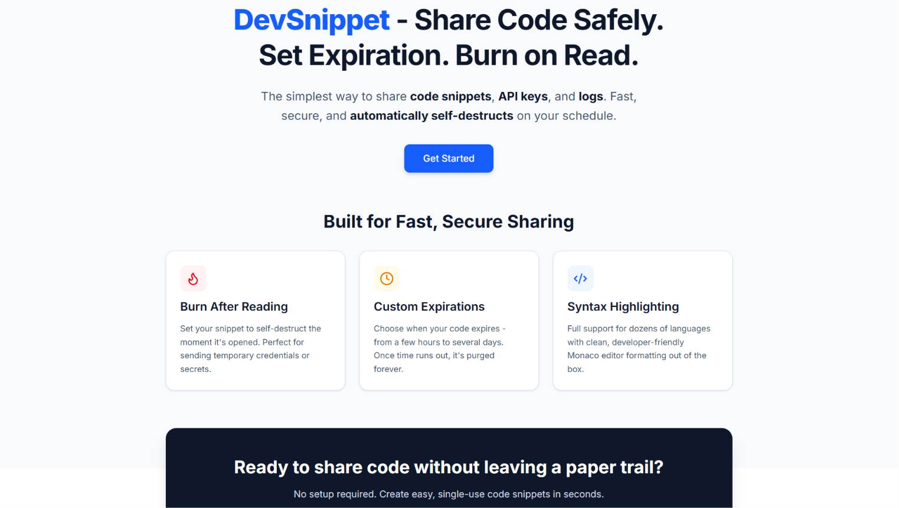
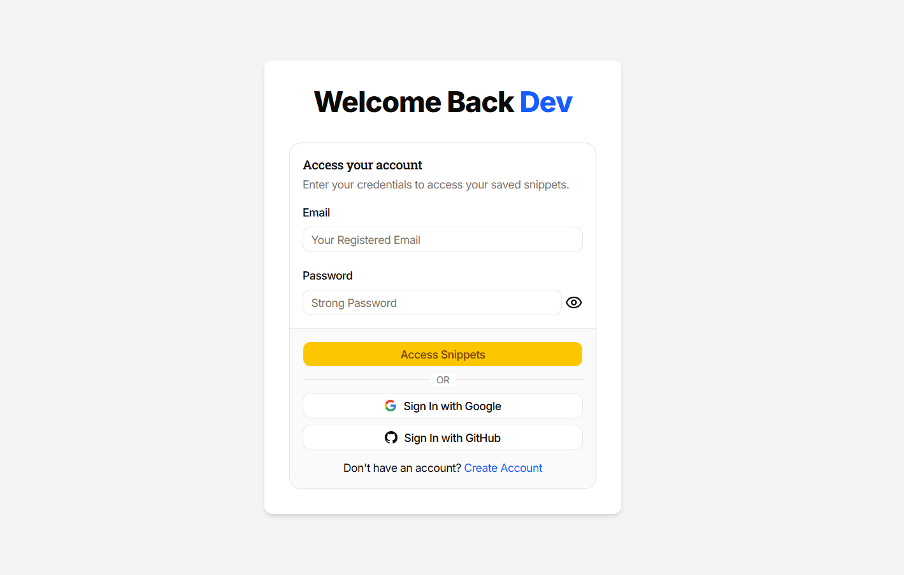
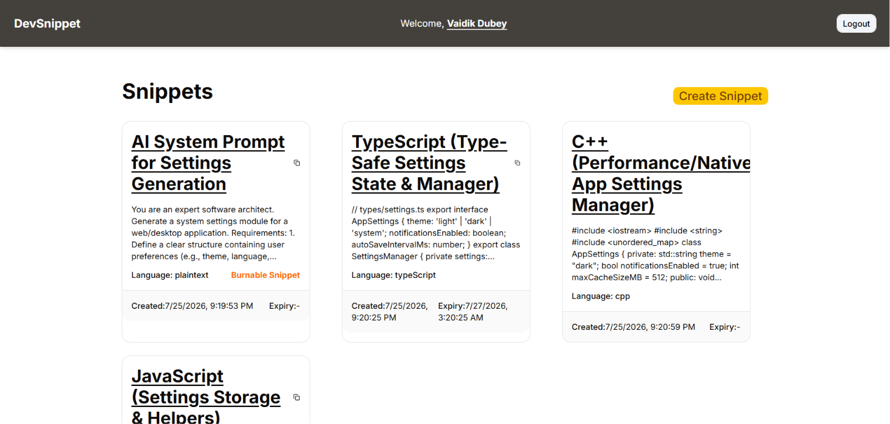
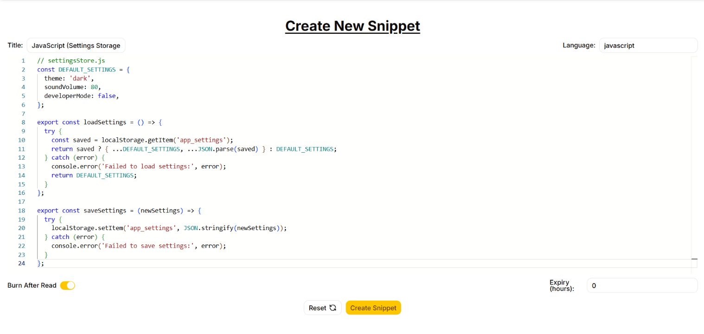
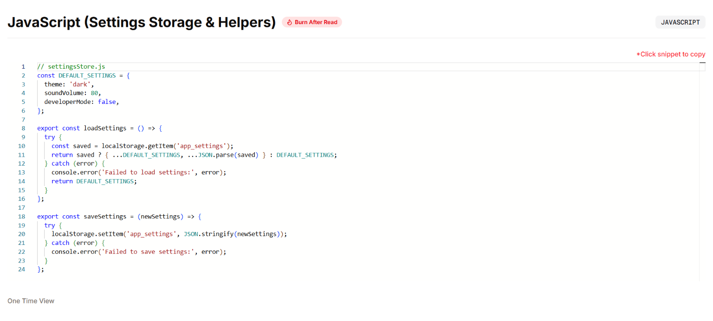

# [DevSnippet 🚀](https://devsnippet-space.vercel.app/)

> A fast, minimal, and privacy-focused code snippet sharing platform built for developers.

**DevSnippet** allows developers to instantly share code snippets with anyone using a unique public link. Whether you're asking for debugging help, sharing configuration files, sending interview solutions, or collaborating with teammates, DevSnippet provides a clean and efficient experience with optional expiration and one-time viewing support.

🌐 **Live Demo:** https://devsnippet-space.vercel.app/

---

## ✨ Features

### 📝 Create Code Snippets

- Write code using the **Monaco Editor** (same editor that powers VS Code).
- Supports syntax highlighting for multiple programming languages.
- Clean and distraction-free editing experience.

### ⏳ Expiration Support

- Set a custom **Time-To-Live (TTL)** while creating a snippet.
- Snippets automatically expire after the specified duration.
- If no expiration is selected, the snippet remains available indefinitely.

### 🔒 Your Private Snippets

- Create account with your email and password.
- Easy login with Google and GitHub OAuth.
- Snippets are associated with your account.
- Only you can view all your snippets and choose which ones to share.

### 🔗 Public Shareable Links

- Every snippet gets a unique public URL.
- Share the link with anyone.
- No authentication required for viewing.

### 🔥 Burn After Reading

- Enable **Burn After Reading** while creating a snippet.
- Once the snippet is opened, it is permanently deleted.
- Ideal for sharing sensitive code, API keys (temporary), or confidential snippets.

### 👀 Read-Only Code Viewer

- Shared snippets are displayed inside a **read-only Monaco Editor**.
- Maintains syntax highlighting and formatting.
- Prevents accidental modifications.

### 📋 One-Click Copy

- Copy the complete snippet to the clipboard with a single click.

### ⚡ Fast & Responsive

- Optimized UI with smooth interactions.
- Responsive design for desktop and mobile devices.

---

# Tech Stack

## Frontend

- Next.js
- TypeScript
- Tailwind CSS
- React Hook Form
- Zod
- Monaco Editor

## Backend

- Next.js API Routes
- NextAuth (Authentication)
- MongoDB
- Mongoose

## Deployment

- Vercel

---

# Folder Structure

```text
DevSnippet/
│
│src
│  ├── client/
│       ├── app/
│       ├── components/
│       ├── lib/
│       ├── context/
│       ├── lib/
│       └── ...
│
├── server/
│   ├── controllers/
│   ├── routes/
│   ├── models/
│   ├── middleware/
│   └── ...
│
└── README.md
```

---

# Getting Started

## Prerequisites

- npm / yarn / pnpm
- MongoDB

---

## Installation

Clone the repository

```bash
git clone https://github.com/your-username/devsnippet.git
```

Move into the project

```bash
cd devsnippet/src
```

### Install dependencies

```
npm install
```

---

# Environment Variables

Create a `.env` file inside the server directory.

```env
MONGODB_URI=your_mongodb_connection_string
NEXT_PUBLIC_APP_URL=http://localhost:3000
NEXTAUTH_SECRET=your_nextauth_secret
GOOGLE_OAUTH_CLIENT_ID=your_google_oauth_client_id
GOOGLE_OAUTH_CLIENT_SECRET=your_google_oauth_client_secret
GITHUB_OAUTH_CLIENT_ID=your_github_oauth_client_id
GITHUB_OAUTH_CLIENT_SECRET=your_github_oauth_client_secret
```

---

# Running the Project

```bash
cd src
npm run dev
```

Open

```
http://localhost:3000
```

---

# How It Works

### Creating a Snippet

1. Write/paste your code.
2. Select the language.
3. (Optional) Set an expiration time.
4. (Optional) Enable **Burn After Reading**.
5. Create the snippet.
6. Share the generated link.

---

### Viewing a Snippet

Anyone with the generated link can:

- View the snippet
- Copy it to clipboard
- Read it in a VS Code-like editor

If **Burn After Reading** is enabled:

- The snippet is deleted immediately after the first successful view.

---

# Screenshots

- Landing Page


- Sign In Page


- Dashboard


- Create Snippet


- View Snippet


---

# Why DevSnippet?

Unlike traditional paste tools, DevSnippet focuses on simplicity and privacy.

✅ No login required for public viewing of snippets

✅ Expiring snippets

✅ One-time viewing

✅ VS Code-like editing experience

✅ Fast sharing

✅ Secure snippets and easy access with Google and GitHub login providers

---

# Future Improvements

- Edit existing snippets
- Syntax auto-detection
- Dark/Light theme toggle
- Favorites & Collections
- Markdown support
- Rate limiting & abuse protection

---

# Built With

- Next.js
- TypeScript
- MongoDB
- Mongoose
- Monaco Editor
- React Hook Form
- Zod
- Tailwind CSS
- Vercel

---

# Contributing

Contributions, issues, and feature requests are welcome.

1. Fork the repository.
2. Create your feature branch.

```bash
git checkout -b feature/amazing-feature
```

3. Commit your changes.

```bash
git commit -m "Add amazing feature"
```

4. Push to the branch.

```bash
git push origin feature/amazing-feature
```

5. Open a Pull Request.

---

# Author

**Vaidik Dubey**

- GitHub: https://github.com/vaidikdubey
- LinkedIn: https://linkedin.com/in/vaidikdubey

---

⭐ If you found this project useful, consider giving it a star!